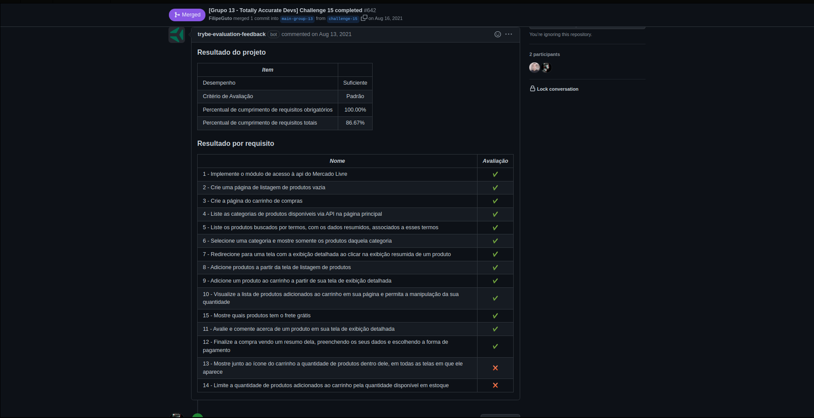

# Project Front End Online Store

Hello and welcome to the Front End Online project!

This was one of the first assignments made by [Trybe](www.betrybe.com) in order to test my skills with React and consuming [Mercado Livre](www.mercadolivre.com)'s API through the endpoint below:

```javascript
"https://api.mercadolibre.com/sites/MLB/search?q=$QUERY"
```

### The Assignment

*In this project you will create a simplified version, without database persistence, of an online store, developing its functionalities in a group according to the demands defined in a Kanban board, in a scenario closer to real world e-commerce. From these demands, we will have an application where users will be able to:*

*- Search for products by terms and categories from the Mercado Livre API;*
*- Interact with the searched products in order to add and remove them from a shopping cart in different quantities;*
*- View details and previous reviews of a product, as well as create new reviews;*
*- Finally, finalize the (simulated) purchase of the selected items.*

### Skills to be Tested

In this project, I was able to:

- Understand what Agile Methods are;
- Understand what Kanban is;
- Understand what Scrum is;
- Work in teams using Kanban or Scrum effectively;
- Practice all skills developed so far in the Front-End module.

### Evaluator Results


